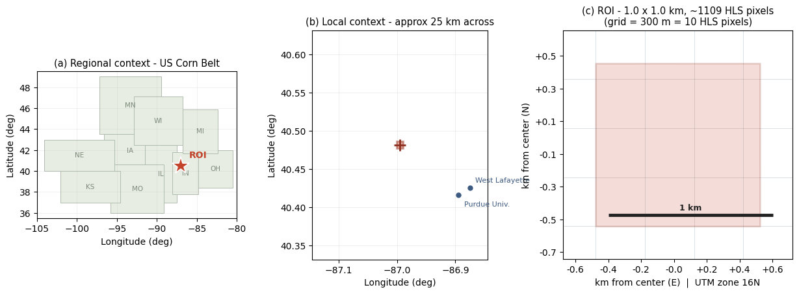
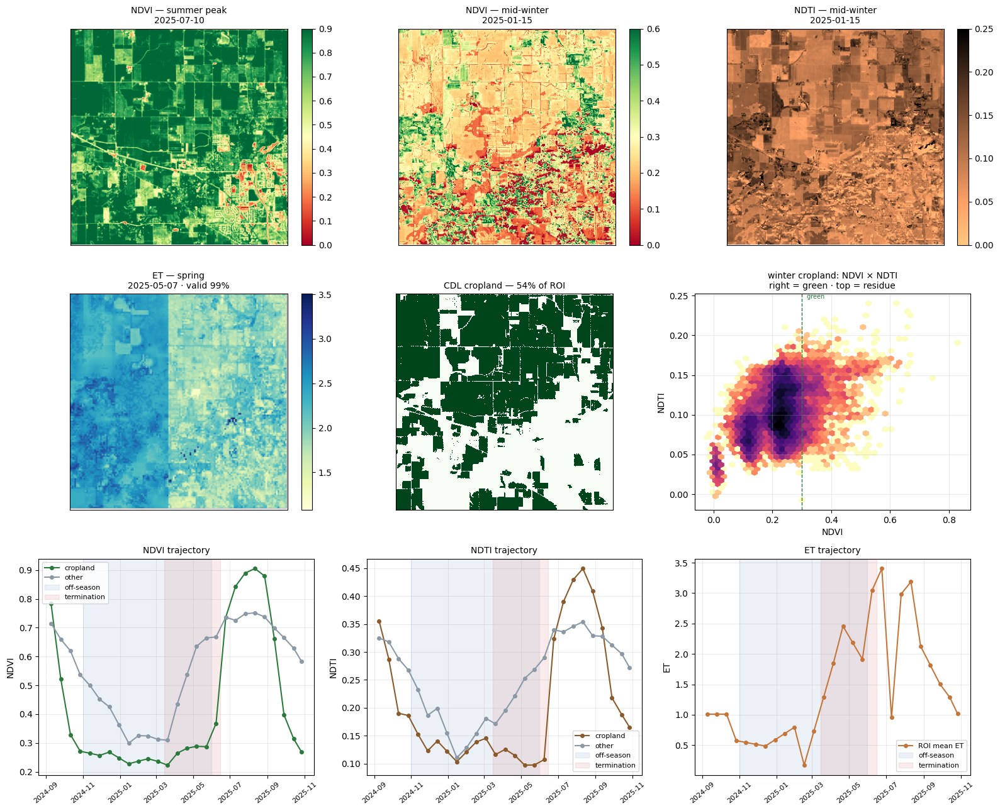
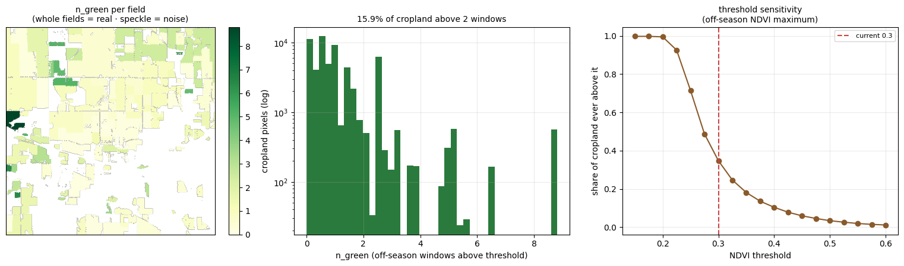

# Tracking Cover Crops at Scale: unlocking field-scale cover crop dynamics via AI-driven satellite harmonization

Postdoc project led by Dr. Yu Peng at the Environmental Data Science Innovation & Impact Lab (ESIIL). It maps cover cropping across the continental US from satellite time series and links the maps to soil carbon and greenhouse gas outcomes. Code is in the [GitHub repository](https://github.com/Eco-YuPeng/Postdoc_Research_Oasis); results are published on this site.

![Homepage overview image][slot-hero]

[Open the GitHub repository](https://github.com/Eco-YuPeng/Postdoc_Research_Oasis){.md-button} [Technical route (v11)](work-plan.md#technical-route-v11){.md-button .md-button--secondary} [Research progress](work-plan.md){.md-button .md-button--secondary}

## Research Abstract

Cover crops affect soil organic carbon (SOC) and greenhouse gas (GHG) fluxes, but no field-scale record of where and when they are grown exists for the US. Satellite detection is limited by signal and by labels. Signal: in Maryland only 62.7% of enrolled cover-crop fields were detected, and detection exceeded 90% only above 361 kg/ha biomass ([Xu et al. 2026](https://www.sciencedirect.com/science/article/pii/S1569843226003699)). Labels: published detectors train on 10³–10⁴ labelled fields; our pilot has 12 field-seasons. This project uses LLMs to synthesize a labelled field database from Land Core ground-truth points, extension on-farm research reports and published studies, uses Land Core for training and independent validation, and trains a detector on harmonized HLS, ECOSTRESS and SAR (Sentinel-1, NISAR) time series to retrieve establishment, biomass and termination at field scale.

## Research Objectives

1. **Synthesizing ground truths via LLMs.** Build the training and validation database from two field-record sources: Land Core ground-truth points (Indiana) and extension on-farm research reports (PFI, Nebraska OFRN, Ohio and others). LLMs extract and standardize each record — location, season, seeding and termination dates, species, cash crop, biomass, no-cover-crop controls — with a confidence tier and source note. Published-study plots (our meta-analyses) are the third, smaller source.
2. **Sensor harmonization.** Fuse HLS, ECOSTRESS land surface temperature and Sentinel-1 into per-field seasonal features that are gap-filled and comparable across years ([FireRX ML model](https://github.com/j-gams/firerx_ml), credited to Dr. Cibele Amaral).
3. **Phenology retrieval (v11).** Random forest on the seasonal features, trained on the Objective 1 labels and validated on withheld Land Core counties and years; retrieve establishment, biomass and termination, and report recall by detectability class.
4. **Continental mapping and ecosystem services.** Anchor county totals to the Census of Agriculture, compare with OpTIS, scale beyond Indiana, and link the maps to SOC and GHG outcomes.

## Ground Truth: Why Land Core Data Matters

Labels, not features, limit the detector. In v9–v10 on the two Indiana pilot fields, any fixed field attribute separated cover crop from control perfectly, so feature comparisons carried no information.

| Study | Labelled units | What it shows |
|---|---|---|
| This project, Indiana pilot | 12 field-seasons (2 fields × 6) | Mechanism case study only; cannot train or compare models |
| OpTIS ([Hagen 2020](https://www.mdpi.com/2073-445X/9/11/408)) | 961 fields | Sensitivity 0.60 against roadside survey |
| [Barnes 2021](https://www.mdpi.com/2072-4292/13/10/1998), Indiana | 1,262 fields (as reported) | Train κ 0.91 vs test κ 0.72: cross-county domain shift |
| [Ma et al. 2025](https://arxiv.org/html/2601.00857) | 47,709 Corteva field-years | Landsat baseline beat AlphaEarth embeddings; only a label set this size could rank them |

| Tier | Source | Strength | Limit |
|---|---|---|---|
| 1 | Literature plots (own meta-analyses) | Treatments, dates, biomass, no-cover-crop controls | Plots often smaller than a 30 m pixel; coordinates uncertain |
| 2 | Extension on-farm reports; citizen science | Field-scale blocks, several states | County-level location; strip width mostly unstated; GLCCP coordinates are jittered zip centroids. 60 m size screen: PFI 44 of 132 pass (74 unknown), NE OFRN 9 of 56 (41 unknown) |
| 3 | Land Core ground-truth sample points, Indiana (use permit under discussion) | Large number of observed points with cover-crop status, statewide | Point count, years and terms to be confirmed; points must be matched to CSB fields |

Tiers 2 and 3 arrive as reports and records in different formats; the LLM pipeline ([Progress 1](work-plan.md#progress-1-automated-extraction-of-field-ground-truth-labels)) converts both into one label schema with a confidence tier per row.

**Training.** Tiers 1–2 give at most a few hundred locatable fields, mostly in Nebraska and Iowa. Land Core supplies a large set of ground-truth points in Indiana, the state of our pilot, which is the route past 12 field-seasons: enough labelled units to compare feature sets and to learn management diversity (planting date, species, previous crop) that plots do not sample.

**Validation.** Land Core points are withheld by county and year and used only for testing. This gives an independent test on observed farm fields, the population the maps will describe, a direct check on the cross-county drop seen in Indiana (Barnes 2021: κ 0.91 → 0.72), and recall by detectability class (`cc_detectable`, `cc_marginal`, `cc_likely_undetectable`, set from seeding date and biomass). Without withheld points, a low recall cannot be split into model error and physical invisibility: missed fields in Maryland averaged 297 ± 209 kg/ha.

What Land Core data must contain to serve as labels:

| Field | Reason |
|---|---|
| Point coordinates, matched to a CSB field boundary | Pixel-level sampling; no location guessing |
| Season and cover-crop status, including confirmed no-cover-crop fields | Negatives; a positive-only set inflates false positives |
| Seeding and termination dates, species | Detection windows; detectability class |
| Cash crop and dates | Separates cover crop from winter wheat and volunteer green |
| Biomass or stand rating, where measured | Stand failure vs. undetectable stand |

Raw points stay internal; only aggregated results and model outputs are published.

## Research Resources

| Resource | Use | Status |
|---|---|---|
| Land Core ground-truth points (Indiana) | Tier-3 labels: training and independent validation (see [Ground Truth](#ground-truth-why-land-core-data-matters)) | Not yet available. Use permit to be discussed with Aria McLauchlan |
| Literature ground truth (`cc_groundtruth.gpkg`) | Tier-1 labels from our meta-analyses | In use |
| Extension on-farm reports (PFI, NE OFRN, Ohio) | Tier-2 labels | Triaged; geolocation running |
| USDA Crop Sequence Boundaries, CDL | Field boundaries and cash-crop history | In use |
| HLS L30/S30, ECOSTRESS | Seasonal optical and thermal features | In use |
| Sentinel-1 | SAR features for v11 | Planned (stage 2) |
| USGS 3DEP lidar | Label source only | Planned (stages 0–1) |
| CyVerse JupyterLab, Data Store `CoverCrop_Fusion/` | Compute and storage | In use |
| [LLM_AutoExtracting_CC](https://github.com/Eco-YuPeng/LLM_AutoExtracting_CC), [firerx_ml_CC](https://github.com/Eco-YuPeng/firerx_ml_CC) | Label extraction; fusion and detection | In use |

## Process Gallery

Figures from the HLS × ECOSTRESS fusion pilot ([firerx_ml_CC](https://github.com/Eco-YuPeng/firerx_ml_CC)). See the [Work Plan](work-plan.md) for details.

  <figure class="media-gallery__card media-gallery__card--image">
    
    <figcaption>Pilot study area — Corn Belt → West Lafayette, IN → ROI grid</figcaption>
  </figure>
  <figure class="media-gallery__card media-gallery__card--image">
    
    <figcaption>Fused cube QC — NDVI · NDTI · ET maps and seasonal trajectories</figcaption>
  </figure>
  <figure class="media-gallery__card media-gallery__card--image">
    
    <figcaption>Phenology layers for FireRX — field map, distribution, threshold sensitivity</figcaption>
  </figure>

## Project Members

![Project identity and collaboration image][slot-group-photo]

| Name | Role | Institution | Responsibilities |
|------------------|------------------|------------------|------------------|
| [Yu Peng](https://esiil.org/about/yu-peng) | Postdoc Researcher | ESIIL | Project lead: data fusion, model development, analysis, and public reporting |
| [Cibele Amaral](https://cires.colorado.edu/people/cibele-hummel-do-amaral) | Project Supervisor | ESIIL | Oversees daily research operations and remote sensing integration |
| [Timothy Bowles](https://vcresearch.berkeley.edu/faculty/timothy-bowles) | Academic Mentor | UC Berkeley | Guidance on agroecology and academic development |
| [Lixin Wang](https://science.indianapolis.iu.edu/people-directory/people/wang-lixin.html) | Advisory Expert | IU Indianapolis | Long-term research continuity and hydroecology expertise |

--8<-- "_generated/image_slots.md"
