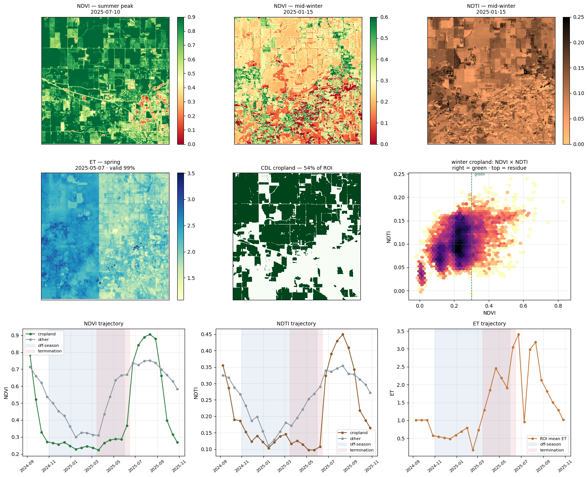
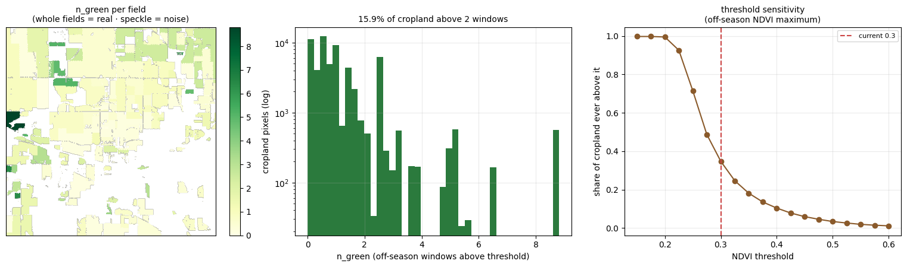

# Work Plan

Landmark: all landmarks apply here, depending on the phase. See the [landmark guide](instructions/postdoc-landmarks.md).

## Onboarding

Landmark: PD-A People and roles; PD-B Question and scope.

- Confirm project goals and research questions
- Identify mentors, collaborators, and communication channels
- Identify key data, compute, and storage needs
- Decide what belongs in GitHub versus persistent storage

## Project Scoping

Landmark: PD-B Question and scope; PD-C Data and access.

- Project summary: [link]
- Research question: [link]
- Data inventory: [link]
- Decision notes: [link]
- Mentor or collaborator notes: [link]

## Active Research

Landmark: PD-D Methods and workflows.

Two workstreams are running in parallel and feed each other:

1. **Objective 1 — automated ground-truth labels.** An LLM-based extraction agent that turns published cover crop field studies into a standardized table of *where, when, and how* cover crops were grown, so the detection model has labelled fields to train and validate against.
2. **Objective 2 — sensor harmonization.** A gap-free, evenly spaced fused image cube from HLS optical data and ECOSTRESS thermal data, compressed into per-pixel phenology layers that the [FireRX ML](https://github.com/j-gams/firerx_ml) sampler can ingest.

- Active work: [LLM_AutoExtracting_CC](https://github.com/Eco-YuPeng/LLM_AutoExtracting_CC) (literature extraction agent) and [CoverCrop_Fusion_v5_2.ipynb](https://github.com/Eco-YuPeng/firerx_ml_CC/blob/main/app_py/CoverCrop_Fusion_v5_2.ipynb) (HLS × ECOSTRESS fusion, phenology layers, layer diagnostics)
- Data and code updates: [firerx_ml_CC repository](https://github.com/Eco-YuPeng/firerx_ml_CC); fused cube and per-scene caches archived in the CyVerse Data Store (`CoverCrop_Fusion/`)
- Compute: CyVerse JupyterLab and VS Code containers; NASA Earthdata (`earthaccess`) for HLS and ECOSTRESS access; Claude-series models through CyVerse's AI-VERDE gateway for the extraction agent
- Open questions or blockers: the labelled-field dataset is still being assembled, so the greenness threshold that drives the phenology layers is provisional (see below)

### Progress: Automated Extraction of Field Ground-Truth Labels

**Why.** No wall-to-wall cover crop label set exists at field scale, but hundreds of published field experiments record exactly what a detection model needs — plot location, the season the cover crop was on the ground, its species, and the cash crop that followed. Extracting these by hand is slow (the manual pass behind my meta-analysis took months for ~90 papers). This workstream builds a reusable agent that does it automatically, verifiably, and in a form other researchers can rerun on their own corpora.

**What the agent does.** The pipeline lives in [LLM_AutoExtracting_CC](https://github.com/Eco-YuPeng/LLM_AutoExtracting_CC), an *agentic repository* forked from ESIIL's [LLM_lesson_exemplar](https://github.com/CU-ESIIL/LLM_lesson_exemplar) template: an `AGENTS.md` file defines how an AI agent (or a person) is allowed to operate inside it, and every run is logged. Given one PDF, the agent:

1. Converts it to Markdown and locates the Methods and Results sections.
2. Pulls **Block 1** (core plot and practice information — coordinates, cover crop species, cash crop, planting and termination timeline) from Methods, using regex and a species gazetteer first and the LLM only for what code cannot get.
3. Classifies which ecosystem-service responses the paper reports (yield, GHG, SOC, nitrogen), then pulls those **Block 2** fields from Results text, tables, or — only when explicitly figure-referenced — a vision read of the chart.
4. Normalizes raw text into controlled-vocabulary fields and computes response ratios by pure math, never by the LLM.
5. Validates species names and coordinates against external services (GBIF / WFO / GeoNames).
6. Tags every field `high` / `medium` / `low` confidence with a source note, and writes one row per experimental unit (treatment × species × year × response). It never fabricates a value it could not find.

The LLM is used only where judgment is required — locating sections, classifying response types, reading figures — and is called through a plain OpenAI-compatible API so the workflow is portable across model providers.

**Ground-truth label schema.** The extraction output is being fused with two tables already built by hand for the meta-analysis (a GHG table, 295 records from 40 papers, and a yield table, 1,026 records from 91 papers) into one US cover crop training/validation dataset for the detection model:

| Design choice | Decision |
|---|---|
| Unit of one row | (site, field/plot, cover-crop season, treatment) |
| Negatives | No-cover-crop control plots are kept as explicit negative labels |
| Season label | `cc_season` keyed to the cover crop **termination** year |
| Required fields | plot location; cover crop year and the period it was present on the surface; species / type (legume vs. non-legume, interseeded or not); cash crop, with planting and harvest dates when reported; cover crop biomass when available |
| Spatial confidence | Tiered — most records are small-plot station experiments smaller than a 30 m pixel, with cover crop and control plots adjacent, so each record carries a confidence tier that downstream sampling can filter on |
| Coordinate QC | Doubtful coordinates are re-checked against multiple sources (paper text, site names, gazetteers) before a record is kept |

**Status.** The repository scaffold, schema, gazetteer, and validation stages are in place; the GHG sub-schema has been converted to long format, real model-calling stages and a multi-row-per-paper extraction step have been added, and a command-line runner with a passing test suite is committed. Development and testing run on CyVerse.

**Next steps.**

- Run the first end-to-end extraction on a single cover crop mixture paper and review the output field by field
- Batch the existing ~94-paper corpus; automatically download open-access PDFs and list paywalled ones for manual retrieval
- Merge the extracted records with the two hand-built tables and publish the labelled dataset with its confidence tiers
- Use the labelled fields to tune the greenness threshold and evaluate the phenology layers from the fusion pilot below

### Preliminary Results: HLS × ECOSTRESS Fusion Pilot

**Study area and period.** A 10 × 10 km square near the Purdue ACRE farm, West Lafayette, Indiana (center −86.995°, 40.482°; UTM 16N), covering September 2024 through October 2025 — one full off-season between the 2024 harvest and the 2025 main crop. Cropland is defined from the USDA Cropland Data Layer (corn and soybeans), which covers 54% of the ROI.

**Inputs.**

| Source | Product | Variable | Native resolution |
|---|---|---|---|
| NASA HLS (Landsat 8/9 + Sentinel-2 A/B) | HLSL30 / HLSS30 v2.0 | NDVI and NDTI (Fmask-masked for cloud, shadow, snow, water) | 30 m |
| NASA ECOSTRESS | ECO_L3T_JET | Daily evapotranspiration (ET), QC-masked | 70 m |
| USDA NASS | Cropland Data Layer | Corn / soybean mask | 30 m |

**What was built.** 116 usable HLS observation days were composited into 27 consecutive 16-day windows (NDVI by median, ET by mean), and remaining temporal gaps were filled by per-pixel linear interpolation. Both reference grids are derived from the ROI polygon itself — not from whichever scene downloads first — so the 30 m and 70 m layers stay registered and span the full study area. The resulting cube is 99.7% valid for NDVI/NDTI and 98.6% valid for ET.

*Figure 1. Visual QC of the fused cube. Top: NDVI at summer peak (2025-07-10) and mid-winter (2025-01-15), and NDTI in mid-winter. Middle: spring ET (2025-05-07, 99% valid), the CDL cropland mask, and the winter NDVI × NDTI plane for cropland pixels. Bottom: seasonal trajectories of NDVI, NDTI, and ET for cropland versus other land, with the off-season (blue) and termination window (red) shaded.*

Key checks all pass: summer cropland NDVI averages 0.84 (bright, healthy main crop), mid-winter cropland NDVI drops to 0.23, and winter cropland NDTI sits at 0.10 — the residue-sensitive range. In the winter NDVI × NDTI plane, green pixels (candidate cover crops, right of the dashed line) separate from residue-covered bare soil (top-left), which is exactly the ambiguity NDVI alone cannot resolve. The ET trajectory is flat and near zero through winter and rises sharply from March into the termination window, consistent with the expectation that thermal data earns its place in April–May rather than mid-winter.

**Phenology layers for FireRX.** Because the FireRX sampler has no time dimension, the 27-step cube was compressed into five per-pixel scalars, each a hypothesis about what separates a cover-cropped field from a bare one:

| Layer | What it measures | Cropland mean |
|---|---|---|
| `n_green` | Number of off-season windows with NDVI above the greenness threshold | 1.11 |
| `ndvi_int` | Green-days accumulated over the off-season | 0.35 |
| `up_slope` | Steepest spring green-up (window to window) | 0.05 |
| `term_drop` | Sharpest drop during the termination window | 0.04 |
| `peak_win` | When greenness peaked between harvest and planting | 6.6 |

*Figure 2. Layer diagnostics. Left: `n_green` aggregated to field objects (whole-field patterns indicate real signal; speckle would indicate noise). Center: distribution of `n_green` over cropland pixels — 15.9% of cropland was green for more than two off-season windows. Right: share of cropland whose off-season NDVI maximum exceeds a given threshold; the current provisional threshold of 0.30 is marked.*

No pair of layers is redundant (largest correlation: `up_slope` / `term_drop`, r = 0.79), so all five are kept. The `n_green` map shows coherent whole-field patches rather than speckle, and roughly 16% of cropland stayed green through more than two off-season windows — a plausible cover-crop adoption rate for this part of Indiana.

**Caveats to keep in mind.** The greenness threshold (NDVI > 0.30) is provisional and will be tuned once labelled fields exist for this ROI. Part of the cube is interpolated rather than measured, and gap-filled winter windows carry less evidence than clear ones. Mid-winter ET is close to zero for both cover crops and bare soil, so the thermal signal is most informative around termination.

**Next steps.**

- Export the five layers as GeoTIFFs and point the FireRX `batch_align_raster` config at them
- Assemble labelled cover-crop fields for the ROI (Objective 1) and sweep the greenness threshold against them
- Add ECOSTRESS LST with overpass-time normalisation as a second thermal channel
- Repeat the pipeline on additional ROIs before scaling to regional tiles

## Synthesis And Writing

Landmark: PD-E Results and synthesis.

- Results summary: [link]
- Figures or tables: [link]
- Manuscript, report, or product draft: [link]
- Reuse and citation notes: [link]

## Outputs And Handoff

Landmark: PD-F Outputs and handoff.

For outputs from the postdoc project, list the full authors or contributors for each product. If you list a paper, presentation, dataset, dashboard, package, report, or educational material, include enough information that future readers can understand who contributed and how to cite or reuse it.

- Final outputs: [link]
- Manuscripts or products: [link]
- Archive resources: [link]
- Handoff notes: [link]

![Placeholder image representing final outputs and synthesis products][slot-outputs]{ .slot-square-image }

--8<-- "_generated/slot_notes/outputs.md"

### Outputs Gallery

--8<-- "_generated/galleries/child/outputs/index.md"

--8<-- "_generated/image_slots.md"
